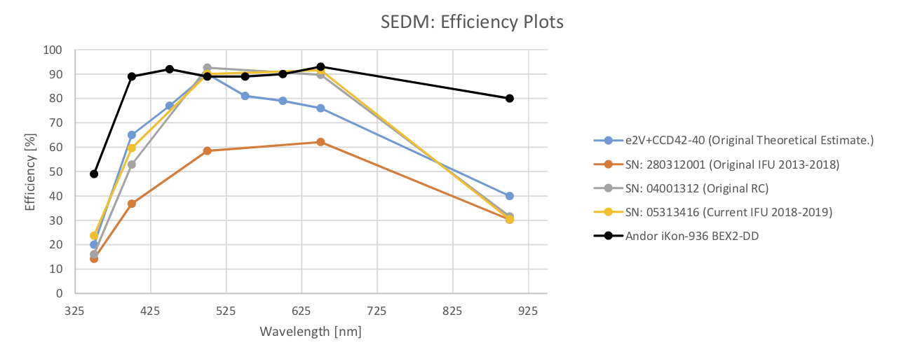
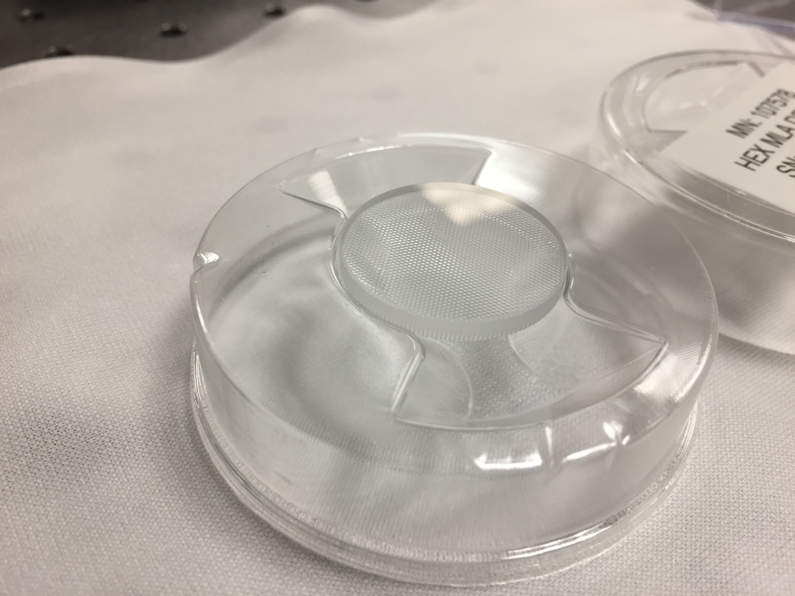
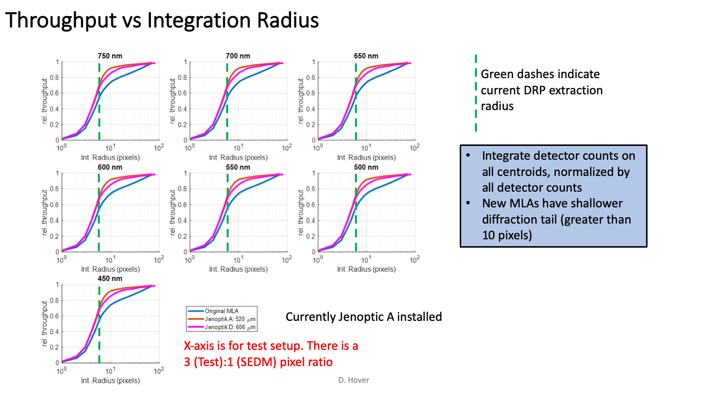

Hardware
========

Here we document the updates to the SEDM hardware.  Only new components are
listed here.  For the original components see the section :ref:`Original Components <original_components>`.

.. table:: Table 1. SEDM Hardware Timeline

    +------------+------------+------------+-----------------------------------------------------------------------------------------+
    | Date       | IFU CCD    | RC CCD     | Description                                                                             |
    +============+============+============+=========================================================================================+
    | 2013/03/12 | 2803120001 | 04001312   | Earliest data set in /scr2/npk/raw on pharos                                            |
    +------------+------------+------------+-----------------------------------------------------------------------------------------+
    | 2014/01/31 | 2803120001 | 04001312   | Earliest definitive appearance of 'stripes' in original IFU CCD data                    |
    +------------+------------+------------+-----------------------------------------------------------------------------------------+
    | 2015/11/15 | 2803120001 | 04001312   | Earliest data set in /scr2/sedm/raw on pharos                                           |
    +------------+------------+------------+-----------------------------------------------------------------------------------------+
    | 2016/02/29 | 08098513   | 04001312   | Loaner CCD from PI for IFU                                                              |
    +------------+------------+------------+-----------------------------------------------------------------------------------------+
    | 2016/03/26 | none       | 08098513   | Moved loaner IFU CCD to RC                                                              |
    +------------+------------+------------+-----------------------------------------------------------------------------------------+
    | 2016/04/25 | 2803120001 | 08098513   | Original IFU CCD (now repaired)                                                         |
    +------------+------------+------------+-----------------------------------------------------------------------------------------+
    | 2016/06/02 | 2803120001 | 04001312   | Original RC CCD (now repaired)                                                          |
    +------------+------------+------------+-----------------------------------------------------------------------------------------+
    | 2016/07/07 | 2803120001 | 08646C7F-  | New PI CCD in RC spot with incorrect SER_NO (should be 05313416)                        |
    +------------+------------+------------+-----------------------------------------------------------------------------------------+
    | 2017/02/28 | 2803120001 | 08646C7F-  | Removed instrument for upgrade #1                                                       |
    +------------+------------+------------+-----------------------------------------------------------------------------------------+
    | UPGRADE #1: Kept mountings and interface plate, re-did enclosure to put electronics outside optics cavity, re-did RC mounting. |
    +------------+------------+------------+-----------------------------------------------------------------------------------------+
    | 2017/09/09 | 2803120001 | 08646C7F-  | Installed instrument with upgraded enclosure, original optics                           |
    +------------+------------+------------+-----------------------------------------------------------------------------------------+
    | 2018/01/11 | 2803120001 | 04001312   | Original RC CCD, New PI CCD sent for repair                                             |
    +------------+------------+------------+-----------------------------------------------------------------------------------------+
    | 2018/05/08 | 05313416   | 04001312   | New PI CCD in IFU spot with corrected SER_NO                                            |
    +------------+------------+------------+-----------------------------------------------------------------------------------------+
    | 2018/06/19 | 05313416   | 04001312   | Installed :ref:`Jenoptik MLA <JOMLA>` PN: 107578 520 micron pitch                       |
    +------------+------------+------------+-----------------------------------------------------------------------------------------+
    | 2018/08/15 | 05313416   | 04001312   | S/N measurement star observations taken                                                 |
    +------------+------------+------------+-----------------------------------------------------------------------------------------+
    | 2018/09/27 | 05313416   | 2803120001 | Put original IFU CCD in RC spot                                                         |
    +------------+------------+------------+-----------------------------------------------------------------------------------------+
    | 2019/01/05 | 05313416   | 2803120001 | Removed instrument for upgrade #2                                                       |
    +------------+------------+------------+-----------------------------------------------------------------------------------------+
    | UPGRADE #2: Re-did interface plate, enclosure, cable management, new pickoff/fold mirrors, kept original optics.               |
    +------------+------------+------------+-----------------------------------------------------------------------------------------+
    | 2019/02/08 | 05313416   | 04001312   | Installed instrument with upgraded enclosure, new pickoff/fold mirrors, original optics |
    +------------+------------+------------+-----------------------------------------------------------------------------------------+
    | 2019/04/18 | 05313416   | 04001312   | Replaced pickoff mirror with Acton coated pickoff, trimmed RC standoffs                 |
    +------------+------------+------------+-----------------------------------------------------------------------------------------+
    | 2019/04/23 | 2803120001 | 04001312   | Replaced fold mirror with Acton coated fold, moved expander lens, cleaned MLA,          |
    |            |            |            | Original IFU CCD installed while New PI CCD sent in for board upgrade                   |
    +------------+------------+------------+-----------------------------------------------------------------------------------------+
    | 2019/05/14 | 05313416   | 04001312   | New PI CCD re-installed in IFU position                                                 |
    +------------+------------+------------+-----------------------------------------------------------------------------------------+
    | 2019/05/15 | 05313416   | 04001312   | Laser verification of optical alignment, re-centered IFU CCD                            |
    +------------+------------+------------+-----------------------------------------------------------------------------------------+
    | 2019/05/20 | 05313416   | 04001312   | Re-set IFU camera and CCD optics stage: achieved good focus @ 0.4 mm                    |
    +------------+------------+------------+-----------------------------------------------------------------------------------------+
    | 2019/06/12 | 05313416   | 04001312   | First evidence of P60 focus problems                                                    |
    +------------+------------+------------+-----------------------------------------------------------------------------------------+
    | 2019/08/11 | 05313416   | 04001312   | S/N measurement star observations taken (focus was good)                                |
    +------------+------------+------------+-----------------------------------------------------------------------------------------+
    | 2019/09/02 | 05313416   | 04001312   | P60 secondary removed for vacuum system overhaul and testing                            |
    +------------+------------+------------+-----------------------------------------------------------------------------------------+
    | 2019/09/07 | 05313416   | 04001312   | P60 secondary re-installed after friction reduction on radial defining points           |
    +------------+------------+------------+-----------------------------------------------------------------------------------------+

Table 1 shows the dates when major changes to the instrument hardware were made.
This table does not capture adjustments of optics or minor hardware changes.
Column 1 is the date the change was made, column 2 is the IFU CCD serial
number, column 3 is the RC CCD serial number, and column 4 describes the
hardware change.

Princeton Pixis CCDs
--------------------

The CCDs ordered from Princeton have very different QE specifications.  From the
beginning up until 2018/05/08, the lowest QE CCD was primarily used for the IFU.
This is also the CCD that exhibits the stripes mentioned in the timeline above.
We installed a new CCD from Princeton on 2016/07/07 in the RC spot where it stayed
until 2018/01/11.  This new CCD has the highest QE and was installed in the IFU
position on 2018/05/08.  This figure shows the QE values from Princeton for each
of the three CCDs that were ordered, along with an e2V theorectical curve
and compares them with an Andor Ikon-936 with a BEX2-DD coating.

    Figure 1. QE values from Princeton Instruments for the SEDM CCDs and from Andor for the Ikon-936.

Optics
------

.. _JOMLA:

Jenoptik Micro-Lens Array
^^^^^^^^^^^^^^^^^^^^^^^^^
Problems with the :ref:`original MLA made by AMS <AMSMLA>` were detected when the spare MLA
was examined under a microscope revealing a :ref:`mis-alignment between the
bi-convex faces of the MLA <fig-mla_offset>`.  A new design was originated by Jason Fucik that
was plano-convex, thereby eliminating any alignment issues.  He contracted with
Jenoptik to manufacture this new design with two pitches for the lenslets:
520 microns and 606 microns.  The 520 micron pitch MLA was found to have the
lowest scattering and was installed in SEDM on 2018/06/19.

    Figure 2. Jenoptik PN: 107578 installed in SEDM on 2018/06/19.

* Jenoptik PN 107578 (520 micron pitch) drawing:

:download:`107578-01A-partdrawing.pdf`

* Jenoptik PN 107597 (606 micron pitch) drawing:

:download:`107597-01A-partdrawing.pdf`

Performance
"""""""""""

While the gross throughput only went up by 25%, the lower scattering provided a
major improvement in performance on-sky.  *The combination of the lower
scattering and the improved QE of the new IFU CCD has reduced our exposure times
by 20%!*

.. figure:: NewMLAPerformance_imgs.png

    Figure 3. Qualitative comparison of scattering between the three MLAs.

    Figure 4. Quantitative comparison of scattering and the basis for choosing the 520 micron pitch MLA.

Expander
^^^^^^^^

Lenslet
^^^^^^^

Collimator
^^^^^^^^^^

Disperser
^^^^^^^^^

Camera
^^^^^^

Mechanics
---------

IFU Focus Stage
^^^^^^^^^^^^^^^

Focus
-----

Strategy
^^^^^^^^

Electronics
-----------

Focus Stage Controller
^^^^^^^^^^^^^^^^^^^^^^

IFU Shutter
^^^^^^^^^^^

RCam Shutter
^^^^^^^^^^^^

Last updated on |version|
