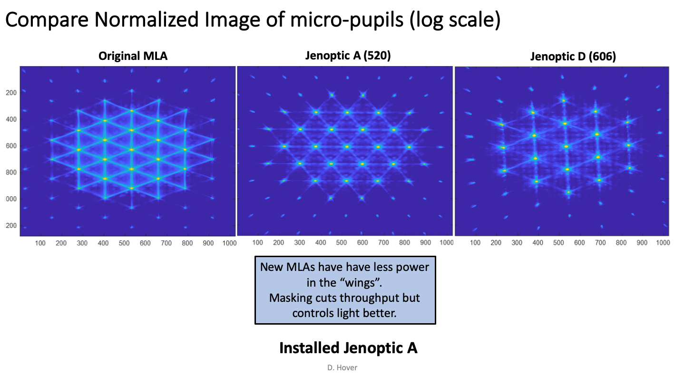

Hardware
========

Here we document the updates to the SEDM hardware.  Only new components are
listed here.  For the original components see the section :ref:`Original Components <original_components>`.

.. _PPCCD:

Princeton Pixis CCDs
--------------------

The CCDs ordered from Princeton have very different QE specifications.  From the
beginning up until 2018/05/08, the lowest QE CCD was primarily used for the IFU.
This is also the CCD that exhibits the stripes mentioned in the :ref:`timeline <Timeline>`.
We installed a new CCD from Princeton on 2016/07/07 in the RC spot where it stayed
until 2018/01/11.  This new CCD has the highest QE and was installed in the IFU
position on 2018/05/08.  This figure shows the QE values from Princeton for each
of the three CCDs that were ordered, along with an e2V theorectical curve
and compares them with an Andor Ikon-936 with a BEX2-DD coating.

    Figure 1. QE values from Princeton Instruments for the SEDM CCDs and from Andor for the Ikon-936.

Optics
------

.. _JOMLA:

Jenoptik Micro-Lens Array
^^^^^^^^^^^^^^^^^^^^^^^^^
Problems with the :ref:`original MLA made by AMS <AMSMLA>` were detected when the spare MLA
was examined under a microscope revealing a :ref:`mis-alignment between the
bi-convex faces of the MLA <fig-mla_offset>`.  A new design was originated by Jason Fucik that
was plano-convex, thereby eliminating any alignment issues.  He contracted with
Jenoptik to manufacture this new design with two pitches for the lenslets:
520 microns and 606 microns.  The 520 micron pitch MLA was found to have the
lowest scattering and was installed in SEDM on 2018/06/19.

.. figure:: MLA_107578_520mu.jpg

    Figure 2. Jenoptik PN: 107578 installed in SEDM on 2018/06/19.

* Jenoptik PN 107578 (520 micron pitch) drawing:

:download:`107578-01A-partdrawing.pdf`

* Jenoptik PN 107597 (606 micron pitch) drawing:

:download:`107597-01A-partdrawing.pdf`

Performance
"""""""""""

While the gross throughput only went up by 25%, the lower scattering provided a
major improvement in performance on-sky.  *The combination of the lower
scattering and the improved QE of the new IFU CCD has reduced our exposure times
by 20%!*

    Figure 3. Qualitative comparison of scattering between the three MLAs.

    Figure 4. Quantitative comparison of scattering and the basis for choosing the 520 micron pitch MLA.

Expander
^^^^^^^^

Lenslet
^^^^^^^

Collimator
^^^^^^^^^^

Disperser
^^^^^^^^^

Camera
^^^^^^

Mechanics
---------

IFU Focus Stage
^^^^^^^^^^^^^^^

Focus
-----

Strategy
^^^^^^^^

Electronics
-----------

Focus Stage Controller
^^^^^^^^^^^^^^^^^^^^^^

IFU Shutter
^^^^^^^^^^^

RCam Shutter
^^^^^^^^^^^^

Last updated on |version|
