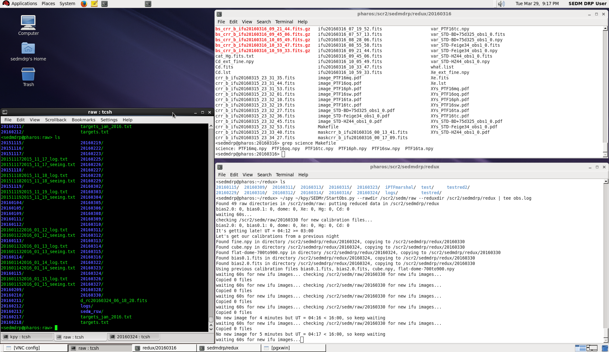
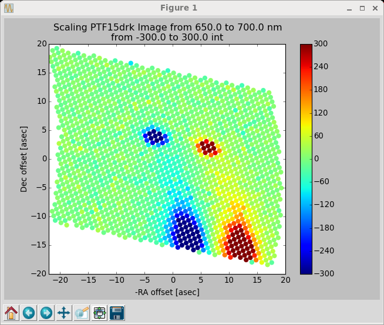
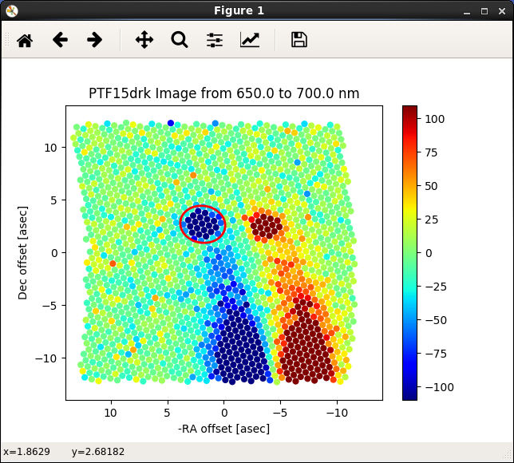
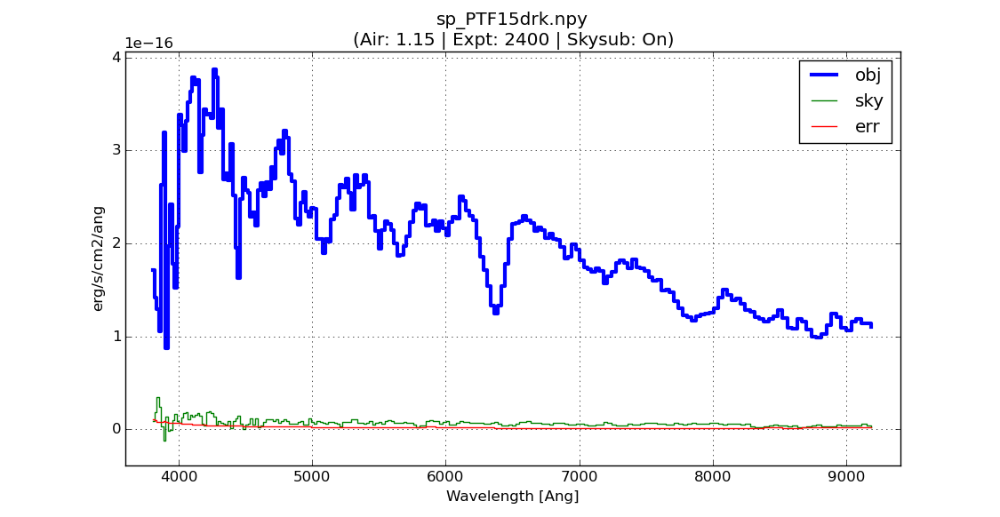

Kpy SEDM Pipeline
=================

Kpy Pipeline Overview
---------------------

**Note:** This pipeline is no longer run on a regular basis.  This documentation
is for posterity.  Please see the section :ref:`SEDM Pipeline <sedm_pipeline>`
for the current pipeline documentation.

Kpy Python Requirements
^^^^^^^^^^^^^^^^^^^^^^^

The IFU pipeline is written in python v2.7 and currently runs under the
miniconda2 distribution (https://conda.io/miniconda.html).  It requires the
astroconda environment from STScI
(https://astroconda.readthedocs.io/en/latest/) and expects the name to be
'astroconda':

``conda create -n astroconda stsci``

There is no IRAF dependancy in the IFU pipeline, but the RCam pipeline
still requires pyraf and the Ureka distribution.

The most up-to-date version of the IFU pipeline (as well as the RCam
pipeline and database routines) can be found at github
(https:github.com/scizen9/kpy.git).

Kpy Pipeline Operations
^^^^^^^^^^^^^^^^^^^^^^^

We are in the process of developing an automated system for data reduction
and analysis.  Currently, the only interactive step in the data reduction
is placing the aperture(s) on the object(s).  For transient followup, the
data are usually taken in A/B pairs to improve the sky subtraction.  This
requires that the observer place an aperture on the A position (positive:
red) and on the B position (negative: blue).  See :ref:`below <Kpy Interactive
Procedure>` for the interactive procedure.  These steps may eventually be
automated, depending on how robust and accurate our astrometry turns out to
be.

Once the apertures have been placed, an ascii spectrum is automatically
generated.  The format of the ascii spectrum is universal enough to be 
input to any classifier (Superfit, e.g.), however, SNID is run on all
targets at the end of the reduction run.  For ZTF targets, a script will
upload the ascii spectra to the GROWTH marshal.

**Note: the examples on this page are from the preceeding suvey, iPTF.**

Kpy Automated Pipeline Operations
---------------------------------

Before the observer interacts with the pipeline, the following steps are
automatically performed:

#. The appropriate reduced directory is created using the UT date:
    * ``/scr2/sedmdrp/redux/20151115`` (e.g.)
#. The required raw calibration files are copied over and reduced.
#. If there is a failure in the reduction, calibrations files from previous runs are copied.
#. All subsequent IFU images are automatically bias-subtracted, cosmic ray cleaned, and background subtracted.
#. Any subsequent standard star IFU observations are reduced and extracted, and a new flux calibration is generated.
#. At the end of the night, all observations that can be automatically extracted are extracted (same as ``make auto``).

Kpy Interactive Procedure
-------------------------

The observer connects with pharos either through VNC (recommended), or via
an X enabled ssh connection (slower).  Below is is a figure showing the
layout of the desktop connected through the VNC connection.

    Figure 1. Pharos sedmdrp desktop on screen 7 (5907).

The automatic pipeline script is running in the bottom right window.  Some
status information can be gleaned from the output there.  The xterm set on
the left may be used by the observer to examine the files on pharos.  A web
browser will be set up on the desktop screen to the right which can be
selected using the chooser on the lower right.  This is where you can
interact with the marshal and the TNS web service to look at finder charts.

Please be sure that the background subtraction has finished for the target
you are reducing.  This is the most time-consuming step.  For each
observation it will perform five iterations of traditional convolution,
followed by an iteration of fast-Fourier convolution.  For the A/B pairs,
it will do this twice.  Check the lower-right window to see if the
background subtraction is in progress.

We record the name of the reducer in the spectrum file(see step 7 below).
This can be made easier if you set the environment variable SEDM_USER to
your name in the top-right xterm window.  It will then come up as the
default name when asked.

In the top-right Xterm window, the observer interacts with the pipeline
using the following steps:

1. cd into current (UT) date directory:
    * ``cd /scr2/sedmdrp/redux/20151115`` (e.g.)
2. Confirm science targets:
    * ``grep science Makefile`` or ``grep other Makefile``
    * A/B pairs will have target names like ``sp_PTF15drk.npy``
    * if the pair has not finished the target name will be something like ``sp_PTF15drk_obs1.npy``
    * do not process partial A/B pairs unless one has failed: the sky subtraction will be inferior
    * NOTE: if a target is bright, then only a single observation is made as the sky subtraction will not be as difficult.
3. Initiate final reduction of science targets:
    * ``make science``  --> to make all science targets or
    * ``make other``  --> to make all non-ZTF science targets or
    * ``make sp_PTF15drk.npy`` --> to make a specific target (e.g.)
    * Note: targets that are already processed will not be re-done, so ``make science`` or ``make other`` is a reasonable step after each pair has been read out.
4. Scale the data cube:
    * Use '>' and '<' keys to adjust the A/B cube scaling limits until good visibility is obtained.
    * Hit 'x' to use new scale or 'q' to abandon adjustments and revert to default scaling.
    * If nothing is seen in the psuedo image, then hit 'n' to indicate no target is seen.

    Figure 2. Scaling the data cube for good visibility of targets.

5. Place aperture on A target:
    * confer with appropriate ZTF marshal cutout images and finder charts (`PTF marshal`__  in this example) for the `target object`__ (e.g.)
    * another source for target placement is the finder charts in the finder directory: ``/scr2/sedm/phot/20151115/finders``, (e.g.)
    * find A object (positive: red)
    * place red aperture on target
    * adjust size with 'z' or 'x' keys
    * adjust shape with '[' or ']' keys
    * adjust orientation with ',' or '.' keys
    * sky subtraction can be toggled on/off with the 'y' key (normally on)
    * left click when sized and placed

__ http://ptf.caltech.edu/cgi-bin/ptf/transient/marshal.cgi
__ http://ptf.caltech.edu/cgi-bin/ptf/transient/view_source.cgi?name=15drk

.. figure:: PTF15drk_AperA.png

    Figure 3. A/B Aperture placement: Aper A goes on positive (red) target.

6. Place aperture on B target:
    * If A/B pair, find B object (negative: blue)
    * place red aperture on target
    * adjust size, shape and orientation of aperture with keys (should be same as A)
    * left click when sized and placed

    Figure 4. A/B Aperture placement: Aper B goes on negative (blue) target.

7. The spectrum will be extracted and then displayed. When prompted, enter quality of observation based on the image and the extracted spectrum as follows:
    * 1 - good         (no problems)
    * 2 - acceptable   (minor problems, near neighbor, e.g.)
    * 3 - poor         (major problems, A or B image missing, e.g.)
    * 4 - no object visible
    * 5 - bogus target
    * Check the finder charts mentioned in step 5. above and if there is no target there, it is most likely a bogus target
    * NOTE: Only quality 1 and 2 will be classified and uploaded to the marshal
    * After quality is entered, you will prompted to enter your name

    Figure 5. Extracted spectrum plot of PTF15drk, awaiting a quality.

8. Completing step 7 will automatically generate an ascii spectrum and a pdf plot:
    * The ascii spectrum (e.g, :download:`PTF15drk_SEDM.txt`)
    * The pdf plot (e.g, :download:`PTF15drk_SEDM.pdf`, see plot above)
    * display the pdf with ``evince PTF15drk_SEDM.pdf`` (e.g.)

9. Redo an object.  If you wish to redo an object because of improper aperture placement, or for any other reason simply type:
    * ``make redo_PTF15drk`` (e.g., for A/B pair)
    * ``make redo_PTF15drk_obs1`` (e.g., for a single-frame observation)
    * You can then re-place the aperture
10. If you typed ``make science`` to initiate the data reduction,
    then an ascii report on the reductions is generated in the file
    ``report.txt``. You can also re-generate it by typing ``make report``.
11. Most results and diagnostic plots are now automatically copied to the
    UT date subdirectory on the documentation web server in the directory
    `linked here`_.  Consult this page to check aperture placement, etc. A
    new page for results can be `found here`_, however, you will need an
    account to access this page.

.. _linked here: http://www.astro.caltech.edu/sedm/redux/?C=N;O=D
.. _found here: http://pharos.caltech.edu/data_access?

12. When the night is complete, we use an automatic script to perform a default classification (using SNID) and update the report.txt file.   To initiate this script, please enter:
     * ``make classify``

13. After examining the results of the classification, we use a script to upload the results to the ZTF marshal and generate a report called ``report_ztf.txt``.  To initiate this script, please enter:
     * ``make ztfupload``

14. The last step is to generate the final report which sends an e-mail report out the to the SEDM team.  To initiate this final step, please enter:
     * ``make finalreport``

Last updated on |version|
