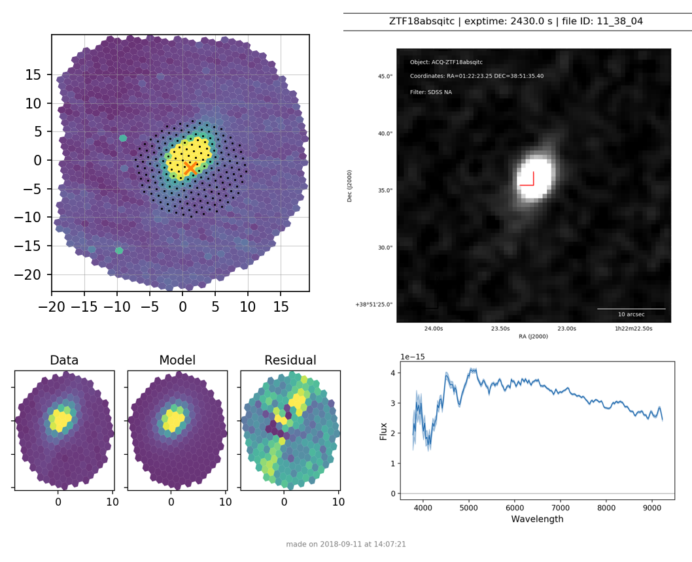

.. _sedm_pipeline:

SEDM Pipeline
=============

Pipeline Overview
-----------------

A new pipeline developed by Mickael Rigault has been installed for
automatic reduction of SEDM data.  The distribution is available on
github__.  It generates a geometry solution from the calibration images and
then automatically extracts target spectra based on the WCS solution of the
guider images.  Please see the documentation that accompanies the github
repository.  The extracted spectrum is classified using SNID__ and if it
is a ZTF target, the ascii spectrum is uploaded to the growth marshal__.
The only interactive step is to generate a final report once all the
extractions have been verified.

__ https://github.com/MickaelRigault/pysedm
__ https://people.lam.fr/blondin.stephane/software/snid/
__ http://skipper.caltech.edu:8080/cgi-bin/growth/marshal.cgi

If there is a failure of the WCS solution, or if the target is particularly
difficult to model with a PSF, there are ways to re-extract the spectrum.
This will be described in more detail below.

Python Requirements
^^^^^^^^^^^^^^^^^^^

The IFU pipeline is compatible with python v2.7 and v3.6 and currently runs
under the miniconda3__ distribution.  It requires the astroconda__ environment 
from STScI and expects the name to be 'astroconda':

``conda create -n astroconda stsci``

__ https://conda.io/miniconda.html
__ https://astroconda.readthedocs.io/en/latest/

Automated Pipeline Operations
-----------------------------

Now we describe the steps that the pipeline takes during the automated
operations.  We start with the pre-science processing that generates the
nightly geometry solution and then continue with the science target
processing.

Pre-Science Processing
^^^^^^^^^^^^^^^^^^^^^^

Pre-science processing occurs in the afternoon and takes roughly 30 minutes
to complete.  In the afternoon when the UT date changes, the following
steps are automatically performed:

#. The appropriate reduced directory is created using the UT date:
    * ``/scr2/sedmdrp/redux/20180907`` (e.g.)
#. The required raw calibration files are linked into the directory as they are taken.
#. Once all the bias files are acquired the master biases are generated.
#. All subsequent calibration files are linked into the directory and then bias-subtracted and cosmic ray cleaned.
#. Once all the calibration files are acquired a geometry solution and flat field is generated.
#. If there is a failure in the geometry solution, geometry files from previous runs are linked in.
#. The most recent fluxcal fits file is linked in, usually from the previous night.

You can verify the success of the geometry solution and flat field by looking
at the plots generated when they are produced.  One is the wavelength solution
dispersion and the other is the flat field.  They will be in the reduced
directory and have names that start with the UT date string (20180907, e.g.).

    Figure 1. Wavelength solution dispersion in Angstroms (20180907_wavesolution_dispersionmap.png).

    Figure 2. Flat field (20180907_flat3d.png).

Science Processing
^^^^^^^^^^^^^^^^^^

Now the SEDM is ready for science images.  Near the end of astronomical
twilight, science image acquisition begins.  The following steps are
automatically performed:

#. All new IFU images are linked in and bias-subtracted and cosmic ray cleaned.
#. The sky lines are used to solve for the flexure offsets for the observation.
#. The geometry solution is used to generate a flexure-corrected cube for the observation.
#. If the target is a standard star:
        a) no guider image is generated.
        b) the brightest spaxel is used to define the extraction region.
        c) PSF-forced spectro-photometry is performed.
        d) a fluxcal fits file is generated.
#. If the target is a science object:
        a) a guider image is generated from all the guider frames and the WCS is solved.
        b) an extraction region in the IFU is based on the guider WCS and the target coordinates.
        c) PSF-forced spectro-photometry is performed.
        d) the most recent fluxcal file is used to calibrate the science target.
        e) the telluric absorption is corrected based on header AIRMASS.
        f) the resulting spectrum is classified using SNID
        g) the SNID results are put in the ascii spectrum header.
        h) the extraction is recorded in a file called ``report.txt``
#. If the target is a ZTF object:
        a) the spectrum is uploaded to the growth marshal.
        b) the marshal URL is recorded in the file ``report_ztf.txt``

The format of the ascii spectrum that is generated is universal enough to
be input to any classifier (Superfit, e.g.).

Quality
^^^^^^^

A quality value is assigned to each spectrum based on several criteria.  In
this scheme, quality values 0, 1, and 2 are considered acceptable.  Any value
above 2 indicates a major problem and the spectrum will neither be classified
nor uploaded to the marshal.  Here is the current quality scheme:

- Quality 0: default quality
- Quality 1: extraction OK (usually recovered from Quality 5)
- Quality 2: a minor problem was encountered (currently not used)
- Quality 3: the telescope offset placed the target outside the IFU
- Quality 4: more than 20% of the flux is negative
- Quality 5: the guide image astrometry failed (for science targets only)

Standard star observations always use the brightest spaxel to define the
centroid.  Therefore, standard stars should never have a quality of 5.

Quality 3 objects cannot be fixed.  Quality 4 and 5 objects may possibly be
fixed, but will require hand-extraction (see Adjustment below).

Interactive Processing
----------------------

All target extractions should be verified and adjusted if required.  Once
that is done a final report is generated that sends out a summary e-mail of
the night's results.  In order to do this, one has to connect to
`pharos.caltech.edu` via a VNC connection.  If the screen lock is active,
just enter the password to unlock it.  Below is is a figure showing the
layout of the main desktop screen connected through the VNC connection.

.. figure:: PharosSEDMdesktopNew.png

    Figure 3. Pharos sedmdrp desktop on screen 7 (5907).

The automatic pipeline script is running in the bottom right xterm window.  Some
status information can be gleaned from the output there.  The xterm set on
the left may be used by the observer to examine the files on pharos.  A web
browser will be set up on the secondary desktop to the right which can be
selected using the chooser on the lower right.  This is where you can
interact with the SEDM web site and the growth marshal and other web
services to look at finder charts.

In the top-right Xterm window, the observer interacts with the pipeline as
described below.  Be sure to `cd` into the current directory, which is the
UT date formatted as YYYYMMDD (20180907, e.g., which would be found in
/scr2/sedmdrp/redux/20180907).

Verification
^^^^^^^^^^^^

The automated pipeline generates verification plots as each image is processed.
These are PNG image files that start with ``verify_``.  You can display all
of them using the ``display`` command from ImageMagick like this:

``display verify_*.png &``

Figures 4 - 6 show the three types of verification plots.  For all three types,
the acquisition finder chart is shown in the upper right and
the IFU spaxel plot is in the upper left.  The PSF extraction results are shown
in the lower left in three plots showing the Data, Model, and Residual.
Finally, in the lower right, is shown some form of the extracted spectrum.  For
a standard star, it will show the calibration check plot comparing the
reference spectrum to the observed spectrum (see Figure 4).

    Figure 4. Verification plot for standard star BD+33d2642

For a science target that has a successful classification from SNID, it will
show the SNID template match plot (see Figure 5).

    Figure 5. Verification plot for successfully typed science target ZTF18abosrco

For a science target for which SNID fails to find a classification, it will
show only the extracted spectrum (see Figure 6).

    Figure 6. Verification plot for unsuccessfuly typed science target ZTF18absqitc

The first step of verification is to compare the B&W finder (upper right) with
the IFU extraction region (upper left).  The red right-angle in the B&W finder
indicates the location of the target.  If the IFU extraction region indicated by
black dots contains the object and the centroid, indicated by either a red X or
a red circle is reasonably close to the target, then this is probably a good
extraction.  Next, examine the PSF fit and residual plots in the lower left.
If the model looks reasonably close to the data and the residuals look like the
model accounted for most of the target's flux, then the extraction was
successful.  This is also bolstered if the spectrum looks good and is either a
good match to a SNID template, or to a reference spectrum, or seems to have
good signal-to-noise.

If you want further verification of the target, you will need to move to the
desktop to the right (using the chooser in the lower right, or by moving the
mouse the the right edge of the desktop).  There you can open a web browser, if
needed, and log into the ZTF marshal, the TNS website, or any other web-based
source of finder charts for the target.

Adjustment
^^^^^^^^^^

There are a few types of adjustment that can be made, depending on the
particular situation.  We will describe the most common ones below.

*NOTE*: if the target was given the quality value of 5 (guide image astrometry
failed), then you must identify the target by hand and reset the centroid
appropriately.

A less common type of adjustment, using an aperture instead of a psf, creates
new files and requires more bookkeeping and is therefore, not recommended unless
specifically required.

Redex Script
~~~~~~~~~~~~

There is a script available that performs many of the bookkeeping tasks
required by re-extraction.  It is called ``redex`` and can be used as follows:

``redex <timestr> [<X Y>]``,

where <timestr> is the UT time stamp for the specific observation, and <X Y>
are replaced by the corrected centroid values as determined from the IFU spaxel
plot.  The <timestr> is formatted:

HH_MM_SS,

and is shown in the title of the verification plot. The ``<X Y>`` values are
optional, and if not included will invoke the ``--display`` option for
``extract_star.py``.  The script does the following:

#. generates a redo timestamp tag based on the current local time: ``redoHHMMSS``,
#. prompt for the user's name (defaults to env var SEDM_USER value),
#. re-run extract_star.py with the appropriate parameters,
#. regenerate the spectrum file for the object with the redo timestamp tag,
#. re-generate the extraction plots with the redo timestamp tag,
#. remove any old classification files generated by SNID,
#. run SNID on the new spectrum,
#. generate new verification plot with redo timestamp tag,
#. display new verification plot and prompt user to either accept or reject re-extraction,
    a) if rejected, delete all files with redo timestamp tag and exit script,
    b) if accepted continue with items below,
#. generate new pysedm_report plot,
#. push this plot to the SEDM-P60 slack channel pysedm-report,
    a) (if you add ``--local`` to command line, this won't happen),
#. if it is a ZTF object, upload new spectrum to the marshal,
    a) (if you add ``--local`` to command line, this won't happen),
#. update pharos DB tables,
    a) (if you add ``--local`` to command line, this won't happen).

Recover a Quality 5 Spectrum
~~~~~~~~~~~~~~~~~~~~~~~~~~~~

Sometimes, even if the astrometry fails, the target will be the brightest object
in the IFU.  In these cases, the extraction will be correct, but it will have a
Quality of 5.  To fix this, just add ``--recover`` to the call to the redex
script:

``redex <timestr> --recover``

This will update the value of Quality for the extraction to 1 in the spectrum
files and the pharos DB, and will upload the updated spectrum to the marshal,
if it is a ZTF object.  Since you have already determined that the extraction
is correct, no plot is displayed and you will not be prompted to approve it.

Adjust Centroid
~~~~~~~~~~~~~~~

This is the simplest adjustment to make.  It will arise in some cases if the WCS
solution of the guider images failed (Quality 5).  This is indicated in the IFU spaxel plot
when the centroid is plotted a red circle instead of a red X.  When the
WCS solution fails, the extraction is defined by the brightest pixel.  This is
fine for standard stars, but does not always work for science targets.
Sometimes even successful WCS solutions will define the centroid in the wrong
place.  Let the finder chart in the verification plot and any other finders
from the web be your guide.

It is also possible that a target that is strongly influenced by a neighbor
(host galaxy, nearby star) can be fixed by just moving the centroid, and hence
moving the extraction region, off of the offending neighbor.

To make this adjustment, you simply need to pass the new centroid to the
`redex` script.  Use the IFU spaxel plot to determine the new centroid for the
target.  Then enter the command:

``redex <timestr> <X Y>``,

using the parameters described above.  Here is an example:

``redex 10_55_22 0 -5``.

The script will display the new verification plot that will allow you to assess
if your new position had the intended effect. This plot will now have a black
cross where your adjusted centroid falls on the spaxels.

    Figure 7. Adjusted centroid indicated by black cross.

It is fine to tweak the centroid and re-extract the spectrum more than once.
It's important to get a good extraction and this sometimes takes more than
one adjustment to the centroid. Just be sure to reject the extraction until
you get an extraction that looks good.

*NOTE*: passing the centroid to the redex script will remove the quality 5
condition.

*NOTE*: there is nothing in the verification plot for this object to indicate
that it needs adjustment.  This was done just to demonstrate the procedure.

Adjust Extraction Region
~~~~~~~~~~~~~~~~~~~~~~~~

This is also a fairly easy adjustment to make.  If the extraction region
includes a neighbor that strongly influences the psf model, and just moving
the centroid doesn't fix it, you can use the `redex` script to invoke the
`--display` parameter of the `extract_star.py` program to re-draw the region.
To do this enter the command without centroid values:

``redex <timestr>``,

which will bring up a display window showing the IFU spaxel plot with the
region and the right is the spaxel map where you can re-draw the region.

    Figure 8. ``extract_star.py`` with the ``--display`` parameter and a hand-drawn extraction region.

Just hit the shift key and draw a region (by left clicking and dragging
the mouse) around your target that does not include the offending neighbor.
Once you release the left mouse button, the selected region will be shown on
the plot (see Figure 8).  If you want to try again, hit the <ESC> key, which
will reset the region, and try again.  If you want to use a new centroid, just
double-click on the location of the new centroid.  This will be required, if
the target was assigned a quality of 5 (guider image astrometry failed).  Once
you are happy with the centroid and region, close the plot.  This is done by
using the menu at the upper left corner of the window and selecting `Close`.
The extraction will proceed once the window is closed.

If you want to abort the re-extraction, choose the `Destroy` option on the
menu and it will halt the re-extraction.

Here is the command that produced Figure 8:

``redex 10_55_22``.

The script will display the new verification plot so you can either accept or
reject this re-extraction.

*NOTE*: if the target was assigned a quality of 5, you will have to
double-click on the target to reset the centroid.  If you do not, the target
will still have a quality of 5 and won't be classified or uploaded.

Fix A Cosmic Ray
++++++++++++++++

Using the ``--display`` parameter also allows you to find and avoid spaxels
that are corrupted by a cosmic ray.  After the `redex` command is entered
(without centroid values), you can click on individual spaxels until you see
the one that is heavily influenced by the cosmic ray.  Then, hit the shift key
and draw your extraction region so as to exclude the offending spaxel.  You may
have to expand the window to more accurately draw the region.

Adjust Extraction Method
~~~~~~~~~~~~~~~~~~~~~~~~

This is a more challenging adjustment to make.  As of now, the two previous
adjustments seem to be able to fix nearly every situation.  If you need to
perform an aperture extraction, please contact the SEDM team and we can
instruct you how to do this.

Final Report
^^^^^^^^^^^^
The last step at the end of the night is to generate the final report which
sends a night summary e-mail report out the to the SEDM team.  To initiate this
final step, please enter:

``make report``

``make finalreport``

It is a good idea to check this e-mail (if you are on the list) and make sure
all of the links work and that the correct extractions are displayed.

Congratulations!  You are done, for now...

Last updated on |version|
