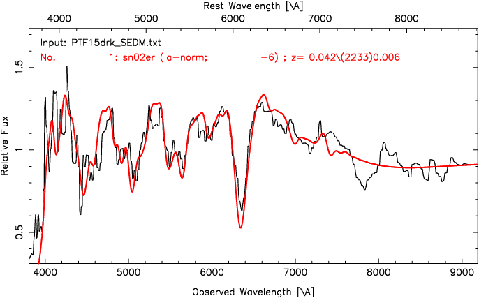

Quick Reference for Observers 
=============================

We are in the process of developing an automated system for data reduction and analysis.  Currently, the only interactive step in the data reduction is placing the aperture(s) on the object(s).  For PTF followup, the data are usually taken in A/B pairs to improve the sky subtraction.  This requires that the observer place an aperture on the A position (positive: red) and on the B position (negative: blue).  See below for a step-by-step procedure.  These steps may eventually be automated, depending on how robust and accurate our astrometry turns out to be.

Once the apertures have been placed, all that remains is to generate an ascii spectrum of the object and then run your favorite classifier.  SNID is provided, but the format is universal enough to be input to any classifier (Superfit, e.g.). The final step is uploading the spectrum and any classification data (type, age, redshift, template figures) to the PTF marshal.  For this, we suggest you use your own account so you are recorded as the observer.

Pre-observing scripted reductions
---------------------------------

Before the observer interacts with the pipeline, the following steps are automatically performed:

#. The appropriate reduced directory is created using the UT date:
    * ``/scr2/sedmdrp/redux/20151115`` (e.g.)
#. The required raw calibration files are copied over and reduced.
#. If there is a failure in the reduction, calibrations files from previous runs are copied.
#. All subsequent ifu images are automatically bias-subtracted and cosmic ray cleaned.
#. Any subsequent standard star ifu observations are reduced and extracted, and a flux calibration is generated.

Step-by-step procedure
----------------------

The observer connects with pharos either through VNC (recommended), or via an X enabled ssh connection (slower).  Then the observer-pipeline interaction proceeds with the following steps:

1. cd into current (UT) date directory:
    * ``cd /scr2/sedmdrp/redux/20151115`` (e.g.)
2. Confirm science targets:
    * ``grep science Makefile``
    * A/B pairs will have targets like ``PTF15drk.npy``
    * if the pair has not finished the target will be like ``PTF15drk_obs1_0.npy``
    * do not process partial A/B pairs unless one has failed: the sky subtraction will be inferior
3. Initiate final reduction of science targets:
    * ``make science``  --> to make all science targets or
    * ``make PTF15drk.npy`` --> to make a specific target (e.g.)
    * Note: targets that are already processed will not be re-done, so ``make science`` is a reasonable step after each pair has been read out.
4. Place aperture on A target:
    * confer with `PTF marshal`__ cutouts and finder charts for the `target object`__ (e.g.)
    * find A object (positive: red)
    * place red aperture on target
    * adjust size with 'z' or 'x' keys
    * left click when sized and placed

__ http://ptf.caltech.edu/cgi-bin/ptf/transient/marshal.cgi
__ http://ptf.caltech.edu/cgi-bin/ptf/transient/view_source.cgi?name=15drk

.. figure:: PTF15drk_AperA.png

    Figure 1. A/B Aperture placement: Aper A goes on positive (red) target.

5. Place aperture on B target:
    * If A/B pair, find B object (negative: blue)
    * place red aperture on target
    * adjust size with 'z' or 'x' keys (should be same size as A)
    * left click when sized and placed

.. figure:: PTF15drk_AperB.png

    Figure 2. A/B Aperture placement: Aper B goes on negative (blue) target.

6. Generate ascii spectrum and confirm extraction:
    * ``chspec sp_PTF15drk.npy`` (e.g.)
    * this will generate :download:`PTF15drk_SEDM.txt`

.. figure:: PTF15drk_SEDM.png

    Extracted spectrum plot of PTF15drk. Close this window to generate PTF15drk_SEDM.txt.

7. Run classifier:
    * ``snid PTF15drk_SEDM.txt`` (e.g.)
    * convert ps output to png:
         * ``ps2png <snid_output>.ps <outfile>.png``

    SNID template fit for spectrum in ``PTF15drk_SEDM.txt``.

8. Record and upload results (type, age, redshift, template plots) to `marshal`__.

__ http://ptf.caltech.edu/cgi-bin/ptf/transient/marshal.cgi

Data Format & Fields of View
----------------------------

Both cameras produce 2048 pixel square images.  The field-of-view of the IFU camera is roughly 30\" on a side, while the Rainbow Camera (RC) has a field-of-view that is roughly 13\' on a side that is divided into quadrants for each of the four filters (``ugri``), which have individual FOVs of about 6.5\' on a side.

Exposure Time Estimates
-----------------------

IFU exposure time recommendations for standard stars (single A exposure):

* 10 - 11 mag --> 120s
* 11 - 12 mag --> 240s
* 12 - 13 mag --> 360s
* 13 - 14 mag --> 500s

Exposures longer than this might be considered for an A/B pair.

IFU exposure time (total) recommendations for science targets (split A/B pair):

* 15 mag --> 420s
* 16 mag --> 600s
* 17 mag --> 900s
* 18 mag --> 1800s
* 19 mag --> 2700s
* 20 mag --> 3600s
* 21 mag --> 5400s
